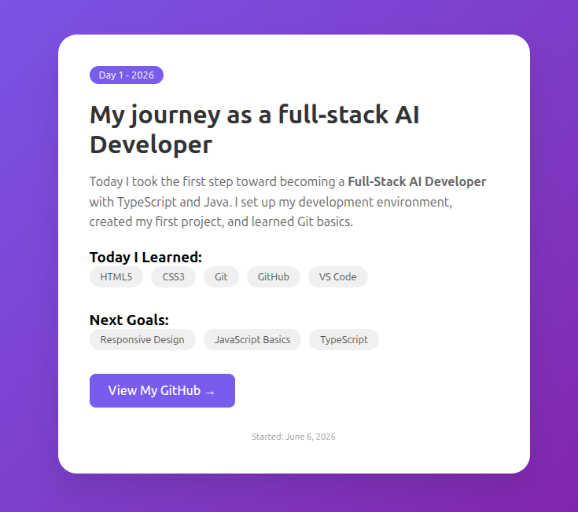

# Day 1: Full-Stack AI Developer Journey

> **Date:** June 6, 2026  
> **Focus:** Development Environment Setup + HTML/CSS Fundamentals

## Project Overview

This project documents **Day 1** of my journey to become a Full-Stack AI Developer specializing in **TypeScript** and **Java** languages. Today I built my first webpage and learned essential developer tools.

##  Technologies Used

| Technology | Purpose |
|------------|---------|
| HTML5 | Page structure |
| CSS3 | Styling and layout |
| Git | Version control |
| GitHub | Portfolio hosting |
| VS Code | Code editor |

##  What I Learned Today

### 1. Development Environment Setup
-  Installed extensions in vs code (Prettier, Live Server, GitLens)
-  Installed Git and verified installation
-  Created a repo on my GitHub account

### 2. HTML Fundamentals
-  Understanding HTML document structure (`<!DOCTYPE html>`, `<html>`, `<head>`, `<body>`)
- Semantic HTML elements
- Creating forms and inputs

### 3. CSS Fundamentals
- Flexbox for layout
- CSS Grid for responsive design
- Gradients and shadows
- Hover effects and transitions

### 4. Git & GitHub
- `git init` - Initialize repository
- `git add .` - Stage changes
- `git commit -m "message"` - Save changes
- `git push` - Upload to GitHub

## Key Code Snippets

### HTML Structure
\`\`\`html
<!DOCTYPE html>
<html lang="en">
<head>
    <meta charset="UTF-8">
    <meta name="viewport" content="width=device-width, initial-scale=1.0">
    <title>Document</title>
</head>
<body>
    <!-- Content here -->
</body>
</html>
\`\`\`

### CSS Flexbox Center
\`\`\`css
.container {
    display: flex;
    justify-content: center;
    align-items: center;
    min-height: 100vh;
}
\`\`\`

## How to Run This Project

1. **Clone the repository**
   \`\`\`bash
   git clone https://github.com/ApiyoMargaret/day1-portfolio.git
   \`\`\`

2. **Navigate to project**
   \`\`\`bash
   cd day1-portfolio
   \`\`\`

3. **Open with Live Server**
   - Right-click `index.html`
   - Select "Open with Live Server"

## Screenshot

## 🔗 Live Demo

[View Live Demo](https://ApiyoMargaret.github.io/day1-portfolio)

## Daily Log

| Day | Topic | Repository |
|-----|-------|------------|
| 1 | Setup + HTML/CSS | [day1-portfolio](https://github.com/ApiyoMargaret/day1-portfolio) |
| 2 | JavaScript Basics | Coming soon |
| 3 | Responsive Design | Coming soon |

## Resources Used Today

- [MDN HTML Guide](https://developer.mozilla.org/en-US/docs/Web/HTML)
- [MDN CSS Guide](https://developer.mozilla.org/en-US/docs/Web/CSS)
- [GitHub Skills](https://skills.github.com/)
- [VS Code Setup Guide](https://code.visualstudio.com/docs/setup/setup-overview)

##  Key Takeaways

1. **Documentation is not optional** - Professional developers document everything
2. **Git commit messages matter** - Write clear, descriptive messages
3. **Consistent daily progress** - Small steps every day compound

## Tomorrow's Goals

- Learn JavaScript variables and functions
- Build an interactive component
- Add form validation
- Deploy to GitHub Pages

---

** Star this repository if you found it helpful!**

 Connect with me: [GitHub](https://github.com/ApiyoMargaret) | [LinkedIn](https://linkedin.com/in/apiyomargaret)

*"The expert in anything was once a beginner." - Day 1 of 365*